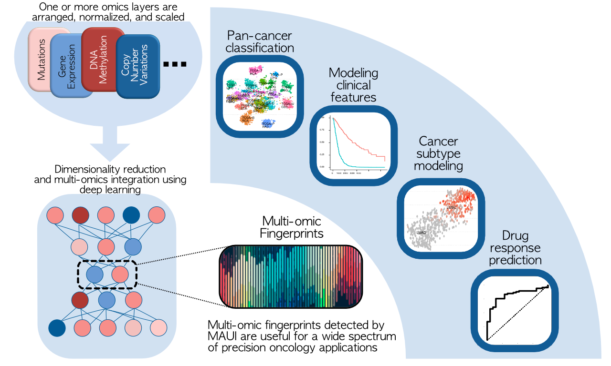

# Introduction

The purpose of this repository is to provide the scripts that are used to produce the figures for the manuscript:
```
Multi-omics and deep learning provide a multifaceted view of cancer
Bora Uyar¹, Jonathan Ronen¹, Vedran Franke¹, Gaetano Garguilo², Altuna Akalin¹
1 Bioinformatics and Omics Data Science Platform, Max Delbrück Center (MDC) for Molecular Medicine, The Berlin Institute for Medical Systems Biology, Hannoversche Str. 28, 10115 Berlin, Germany
2 Molecular Oncology, Max Delbrück Center (MDC) for Molecular Medicine, Robert-Rössle-Stsse 10, 13125 Berlin, Germany
```

See manuscript on [bioRxiv](https://www.biorxiv.org/content/10.1101/2021.09.29.462364v1)

Cancer is a complex disease with a large financial and healthcare burden on society. One hallmark of the disease is the uncontrolled growth and proliferation of malignant cells. Unlike Mendelian diseases which may be explained by a few genomic loci, a deeper molecular and mechanistic understanding of the development of cancer is needed. Such an endeavor requires the integration of tens of thousands of molecular features across multiple layers of information encoded in the cells. In practical terms, this implies integration of multi omics information from the genome, transcriptome, epigenome, proteome, metabolome, and even micro-environmental factors such as the microbiome. Finding mechanistic insights and biomarkers in such a high dimensional space is a challenging task. Therefore, efficient machine learning techniques are needed to reduce the dimensionality of the data while simultaneously discovering complex but meaningful biomarkers. These markers then can lead to testable hypotheses in research and clinical applications. In this study, we applied advanced deep learning methods to uncover multi-omic fingerprints that are associated with a wide range of clinical and molecular features of tumor samples. Using these fingerprints, we can accurately classify different cancer types, and their subtypes. Non-linear multi-omic fingerprints can uncover clinical features associated with patient survival and response to treatment, ranging from chemotherapy to immunotherapy. In addition, multi-omic fingerprints may be deconvoluted into a meaningful subset of genes and genomic alterations to support clinically relevant decisions. 

<p align="center">
   
</p>


# 1. TCGA data analysis

## 1.1 Downloading TCGA data

### 1.1.1 GEX + MUT + METH: download.tcga.R
This script uses TCGAbiolinks package to download gene expression (FPKM), methylation, and mutation data
files along with patient-related clinical meta-data. 

The data is first downloaded into the "GDCdata" sub-folder in the current working directory. 
From there the data is further processed and prepared, which is saved under "GDCdata_prepared".

usage:
``` 
/opt/R/4.0/bin/Rscript ./src/download.tcga.R `pwd` `pwd`/GDCdata_prepared
```

### 1.1.2 CNVs: download.tcga.firehore.R

This script uses RTCGAToolbox and TCGAbiolinks packages to download Somatic Copy Number Alteration (GISTIC scores) 
from BROAD Firehose data. 

The data is first downloaded into the "/GDCdata/FirehoseData" sub-folder in the current working directory.
From there the data is further processed and prepared, which is written under "GDCdata_prepared".

usage:
```
/opt/R/4.0/bin/Rscript ./src/download.tcga.firehose.R `pwd`/GDCdata/FirehoseData `pwd`/GDCdata_prepared 
```

### 1.1.3 MSI: download.tcga.MSI.R

This script uses TCGAbiolinks data to download Microsatellite Instability (MSI) status annotations for 
TCGA projects (pan-gastrointestinal cancers). 

The data is first downloaded into the "/GDCdata/FirehoseData" sub-folder in the current working directory.
From there the data is further processed and prepared, which is written under "GDCdata_prepared".

usage: 
```
/opt/R/4.0/bin/Rscript ./src/download.tcga.MSI.R `pwd` `pwd`/GDCdata_prepared
```

### 1.1.4 Clinical data

Pancancer survival and further clinical data from [Liu J. et al, Cell, 2018](https://www.sciencedirect.com/science/article/pii/S0092867418302290?via%3Dihub)
can be imported using the `RDS` object under `./data/TCGA.surv.RDS`.

Pancancer clinical data downloaded from TCGA can be imported using the `RDS` object under `./data/TCGA.clin.RDS`. 

## 1.2. Multi-omics Integration of TCGA data

Here we describe how to prepare the omics datasets and how to run multi-omics integration tools: MAUI, MOFA, MCIA, and PCA. 

`setup_experiments.R` script prepares the inputs and `snakefile.py` script runs a snakemake pipeline on all the inputs. 

Both scripts require a `settings.yaml` file which includes all necessary input and tool configurations. 

See `./settings.yaml` file that was used as input for both scripts.

### 1.2.1 Preparing omics datasets 

Here we prepare the input files for multi-omics integration tools. The input files for 
these tools will be prepared under `./assays` folder. 

usage: 
```
/opt/R/4.0/bin/Rscript ./src/setup_experiments.R --settings ./settings.yaml
```

### 1.2.2 Running multi-omics integration tools 

Here we run a snakemake pipeline which invokes commands to run MAUI, MOFA, MCIA, and PCA to 
do multi-omics integration. The outputs including the learned latent factors along with feature importance 
values are written under `./output`. 

usage:

```
time snakemake -p -s ./src/snakefile.py -j 10 --configfile ./settings.yaml --keep-going
```


# 2. anti-PD-L1 (Immunotherapy Response) Data Analysis 

anti-PD-L1 (immunotherapy) response prediction was carried out using transcriptome data from [Mariathasan et al, Nature, 2018](https://www.nature.com/articles/nature25501). 

## 2.1 Data download and preparation

The transcriptome data was extracted from the source of the R package [IMvigor210CoreBiologies](http://research-pub.gene.com/IMvigor210CoreBiologies). 

- Download and unpack source code of `IMvigor210CoreBiologies` from here: http://research-pub.gene.com/IMvigor210CoreBiologies/packageVersions/IMvigor210CoreBiologies_0.1.13.tar.gz

- Run `prepare_data.immther.R` script to prepare data for processing with MAUI, MOFA, and PCA. (MCIA doesn't work with a single omics layer). 

usage:

```
cd immunotherapy_analysis
wget http://research-pub.gene.com/IMvigor210CoreBiologies/packageVersions/IMvigor210CoreBiologies_0.1.13.tar.gz
tar -xzvf IMvigor210CoreBiologies_0.1.13.tar.gz
/opt/R/4.0/bin/Rscript ../src/prepare_data.immther.R ./IMvigor210CoreBiologies ../data/hallmarks_plus_xcell.txt
```

## 2.2 Run omics tools 

We run MAUI, MOFA, and PCA to learn latent factors for this dataset. 

usage:
```
time snakemake -p -s ../src/snakefile.py -j 4 --configfile ./settings_immther.yaml --keep-going
```


# 3. Manuscript Figures

`compile_figures.R` script is used to invoke `manuscript_figures.Rmd` file to make the manuscript figures in this study. 

The settings file for pan-cancer analysis, the project folder for immunotherapy analysis, and the figure data for TMZ-GBM analysis need to be provided. 

usage: 
```
nohup time -v /opt/R/4.0/bin/Rscript ./src/compile_figures.R ./src/manuscript_figures.Rmd `pwd`/settings.yaml `pwd`/immunotherapy_analysis `pwd`/data/tmz_gbm_figure_data `pwd`/figures `pwd` > figures.log
```


